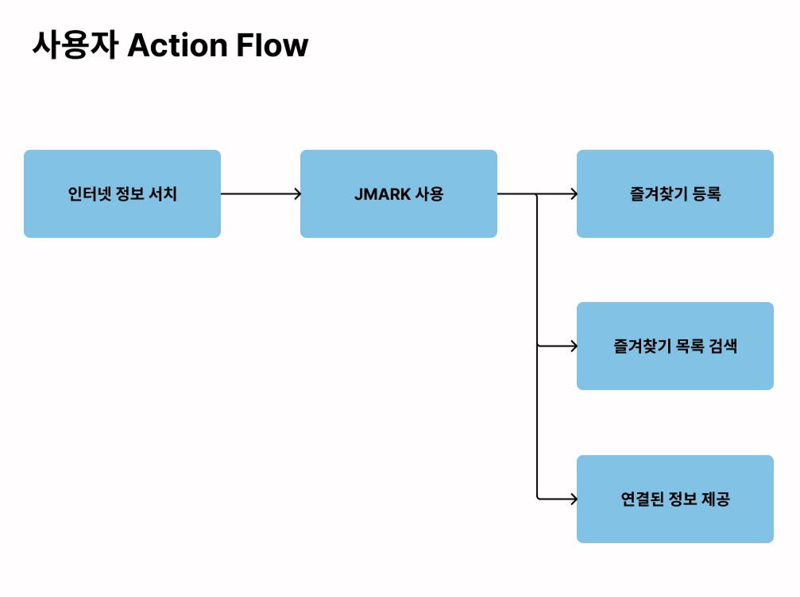
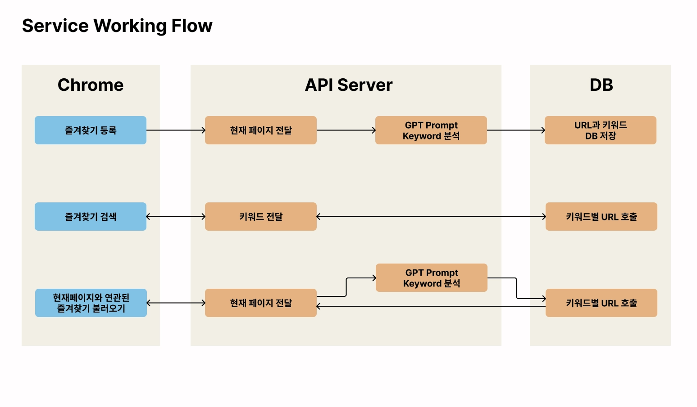
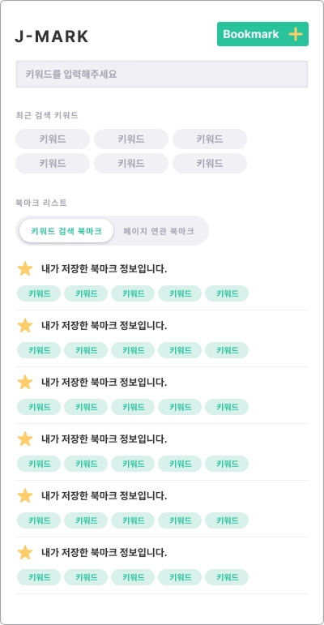
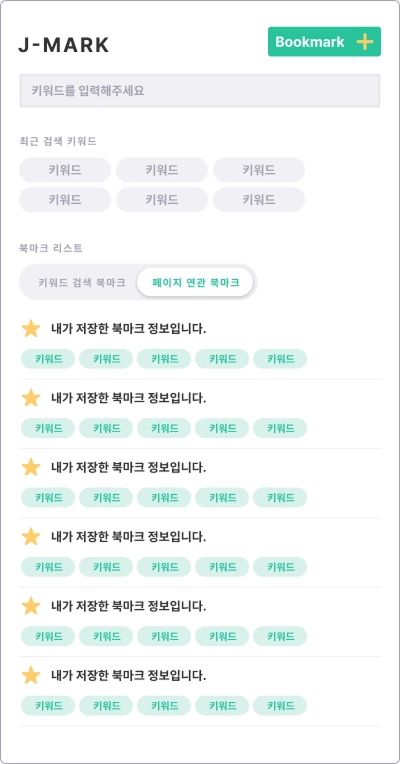
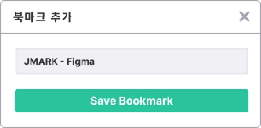

# J-Mark

### 나만의 지식 책갈피 - 자동으로 정리하고 분류하는 검색 가능한 메모장

관리하기 힘든 북마크를 키워드 기반으로 분류하고, 현재 보고 있는 웹페이지와 연관된 정보를 자동으로 연결해주는 Chrome 확장 프로그램입니다.

## 문제 인식

### 고객
너무 많은 정보를 검색해야 하는 인터넷 사용자

### 해결하는 문제
1. **북마크 탐색의 불편함** — 폴더가 너무 많아 저장한 URL을 찾기 어렵고, 분류 작업을 개인이 직접 하기 어려움
2. **분류 기준의 어려움** — 북마크를 하나로 묶을 때 어떤 폴더명을 써야 할지 판단하기 어려움
3. **북마크 재방문 부재** — 등록 후 다시 보지 않는 문제, 현재 탐색 중인 정보와 연결되지 않기 때문

## 기능

### 북마크 저장
특정 URL에 대해 GPT가 본문 텍스트를 분석하여 키워드를 자동 추출하고 저장합니다. 나중에 데이터를 쉽게 찾아볼 수 있도록 다중 키워드 태그로 관리합니다.

### 키워드 기반 북마크 검색
단일 또는 쉼표로 구분된 다중 키워드로 저장된 북마크를 검색합니다. 최근 검색 키워드 6개를 표시하여 재사용이 가능합니다.

### 페이지 맥락 기반 북마크 추천
현재 보고 있는 웹페이지의 본문 텍스트를 GPT로 분석하여 연관도 높은 북마크를 자동으로 추천합니다. 새로운 지식을 탐색하는 중에도 관련 정보를 놓치지 않도록 도와줍니다.

### 기능 (추가 예정)
- 북마크에 나만의 메모를 추가하고, 메모와 연관된 데이터를 자동으로 제공
- ToDo 형태로 학습 계획을 자동 생성하고 지속적인 학습을 관리

## 사용자 Action Flow



## Service Working Flow



## UI 스크린샷

| 키워드 검색 북마크 | 페이지 연관 북마크 | 북마크 추가 |
|---|---|---|
|  |  |  |

## 기술 스택

| 분류 | 기술 |
|---|---|
| Frontend | React 18, TypeScript |
| 상태 관리 | Redux, Redux-Saga, typesafe-actions |
| HTTP | Axios |
| Extension | Chrome Extension Manifest V3 |

## 아키텍처

```
Popup (React)
  ├── Content Script (content.js)    # 페이지 DOM에서 데이터 추출
  ├── Service Worker (background.js) # 추출 데이터 임시 저장 및 전달
  └── Redux Store                    # 전역 상태 관리
```

**통신 흐름:**
```
Popup → chrome.tabs.sendMessage(tabId) → Content Script
Content Script → chrome.runtime.sendMessage → Service Worker (저장)
Popup → chrome.runtime.sendMessage → Service Worker (회수) → Redux Store
```

팝업이 열리는 순간 현재 활성 탭의 URL, 타이틀, description, 본문 텍스트를 순차적으로 자동 수집하여 Redux Store에 저장합니다.

## 설치 및 실행

### 빌드
```bash
npm install
npm run build
```

### Chrome 확장 프로그램 로드
1. Chrome 주소창에 `chrome://extensions` 입력
2. 우측 상단 **개발자 모드** 활성화
3. **압축해제된 확장 프로그램을 로드합니다** 클릭
4. `build` 폴더 선택
